# Installation & Running

1 - `docker compose up -d` to create the **Postgres**, **Kafka**, **Redis** and **kafka-ui**;
2 - Rename the `.env.example` file to `.env`
3 - After verifying that all containers have been created in step 1: `./mvnw clean install` to build the project, install dependencies and run tests;
4 - `./mvnw spring-boot:run` to start the application.

OBS.: If someone of the containers are not created (except kafka-ui), the application will not
run. It may happen that at some point the kafka container doesn't start up the first time.


# Testing

As user registration is not the responsibility of the wallet microservice, the application database will be created with 3 test users.

<p align="center">
  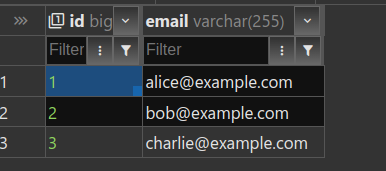
</p>

**OBS.: If the addresses do not open in the normal browser tab, try opening them in the incognito tab.**

1 - Access the Swagger UI through the address `http://localhost:8080/swagger-ui/index.html`

<p align="center">
  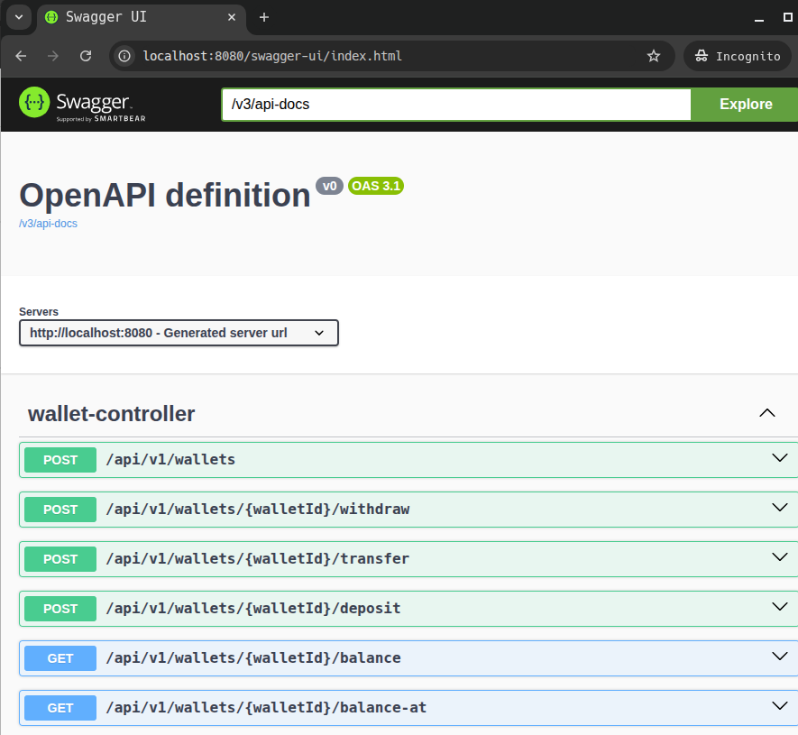
</p>

2 - Start by creating a wallet for one of the users already registered in the database.

<p align="center">
  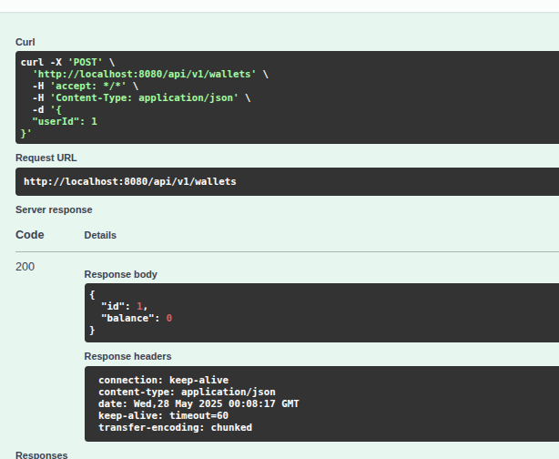
</p>

3 - Check balance to note database access:

<p align="center">
  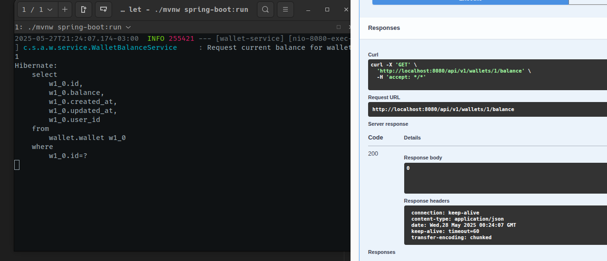
</p>

After the first balance check, the value is cached:

<p align="center">
  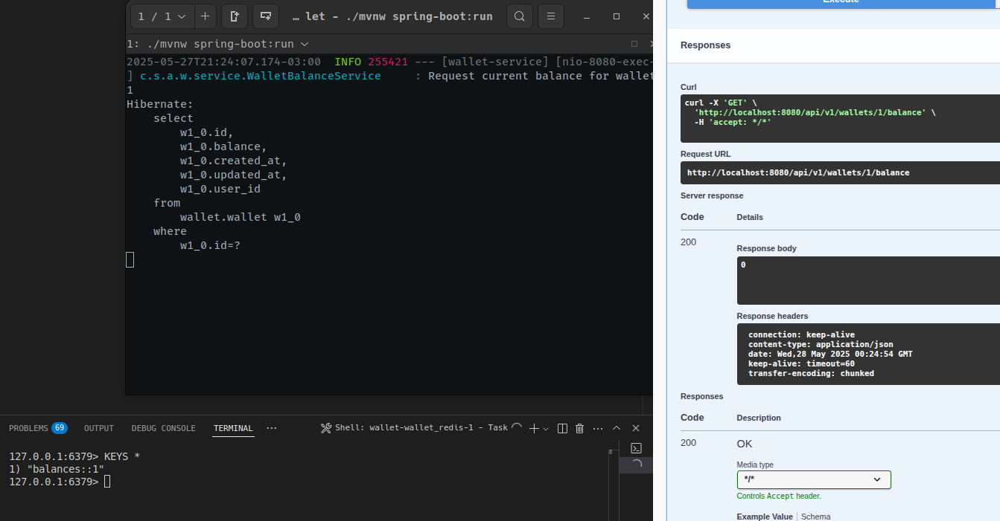
</p>

4 - Make a deposit:

<p align="center">
  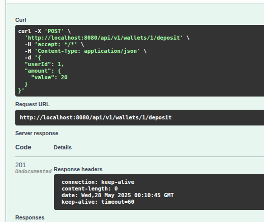
</p>

To see the message sent to the deposit topic, access the address http://localhost:7777/, in the topics tab, access the deposit topic, in the Messages tab you can see the message sent.

<p align="center">
  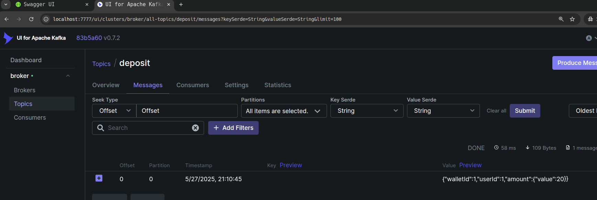
</p>

The deposit invalidates the cache created when searching for the balance:

<p align="center">
  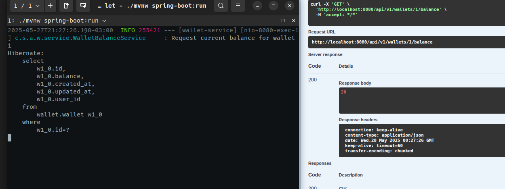
</p>

5 - Make a withdrawal:

<p align="center">
  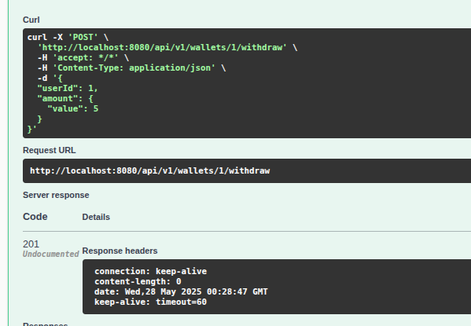
</p>

Consulting the withdrawals topic:

<p align="center">
  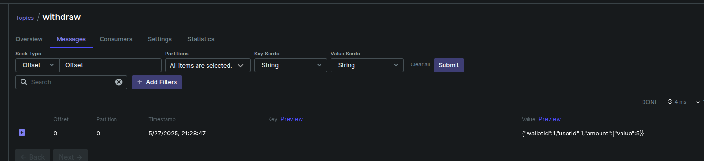
</p>

Check the balance after making the withdrawal (the balance cache was also invalidated with the withdrawal action):

<p align="center">
  
</p>

6 - To make a transfer, first create another wallet for another user (2 or 3).

<p align="center">
  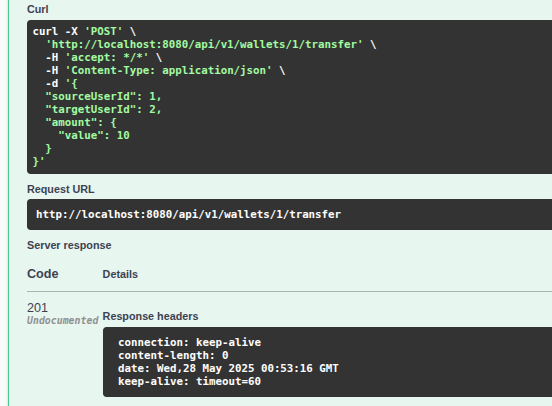
</p>

Consulting the transfer topic:

<p align="center">
  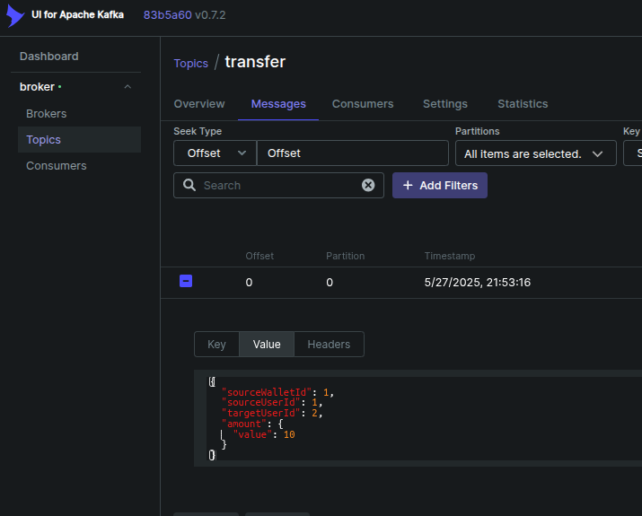
</p>

Checking wallet balance 1 (source):

<p align="center">
  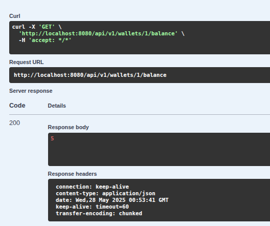
</p>

Checking wallet balance 2 (target):

<p align="center">
  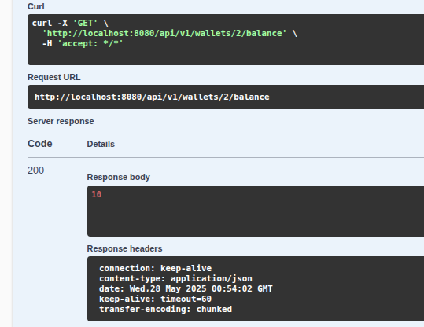
</p>

7 - Checking transaction log:

Transactions:
<p align="center">
  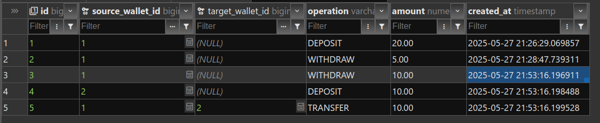
</p>

Request:
<p align="center">
  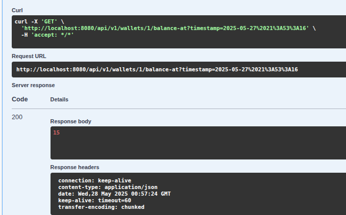
</p>

# Design Choices

## Functional

### Creating a wallet

### Get Wallet Balance

- Since the balance may not change very often, it was decided to add a cache for this operation to 
  reduce access to the database. However, if an operation occurs that changes the balance (deposit, withdrawal, transfer), the cache will be invalidated.

### Deposits and Withdrawals

- Validate ownership and balance, when applicable, i.e. a user cannot deposit or withdraw to a wallet other than their own;
- Both operations generate traceable transactions
- The balance cache is invalidated as soon as the operation is completed
- If any failure occurs in the operations, the entire process will be reversed due to the use of transactions.

### Transfers

- Validates source/target ownership and existence.
- Withdraws from the source wallet and deposits into the target.
- Consequently, a transfer will generate three transactions, since there must be a withdrawal from the source wallet, followed by a deposit into the target wallet and a record of the transfer between both wallets.
- If any failure occurs in the operations, the entire process will be reversed due to the use of transactions.

### Historical Balance

- Performs an aggregate sum of deposits, withdrawals and transfers in a given period in the past;
- As the trend is for the number of transactions to grow rapidly, the two indexes below were added,
  one to facilitate the search for deposits, withdrawals and sent transfers and another for received transfers

```
-- Index for deposits, withdrawals, and sent transfers
CREATE INDEX idx_tx_log_source_wallet_op_created_at
    ON transaction_log (source_wallet_id, operation, created_at);

-- Index for received transfers
CREATE INDEX idx_tx_log_target_wallet_op_created_at
    ON transaction_log (target_wallet_id, operation, created_at);
```

## Non-Functional

### Thread-safety

- Deposit, withdrawal and transfer operations are locked PER WALLET using `ReentrantLocks`, i.e. there is no global lock.
- This design prevents race conditions and allows safe simultaneous operations on different wallets.

### Atomicity
- All transactional operations use the @Transactional annotation with defined rollbacks, which ensures that, in the event of a failure, the operations are rolled back to maintain consistency.
- The use of a relational database is also important for financial operations, so we have greater consistency and atomicity.

### Scalability

- The use of a microservices architecture by nature already makes the application more scalable
- To prevent the service from being overloaded with too many requests, a queue system using Kafka was added. Thus, operations occur asynchronously and are stored for reprocessing in case of failures and/or unavailability
- The blocking is granular, affecting only the wallets involved.
- Caching of current balances improves read throughput (@Cacheable) - could also be added at other points where data changes infrequently;

### Traceability

- All operations generate transactions in the `transaction_log` table. This way, it is possible to check the status of a wallet at different points in the past and the directions in which the money flows.
- The use of Kafka also helps with traceability, since it stores copies of the messages received.

### Environment Management

- Configuration values ​​(e.g., DB credentials) can be injected via environment variables or .env files.
- Configurations using docker to facilitate application deployment in different environments.

# Trade-offs

Below is a list of things that could be improved and that were not possible due to time constraints. This list 
would also serve as a guide to continue developing the application if it were being developed in a real project.

- More specific tests: jakarta validation, hibernate annotation
    - Segregate tests into smaller units;
    - Perform tests on input and output data.
- Implement integration tests;
- Improve object generation in tests using something like Easyrandom. It would help to remove Magic Numbers and static strings used in object generation in tests;
- Centralize error messages in an enum class or in a message.properties file;
- Add test coverage (JaCoCo)
- Authentication:
  - Offline token validation to avoid overloading the authentication server.
- Separate operations by microservices: deposit-service, withdraw-service and transfer-service;
- Explore Kafka configurations in more depth; - It would better separate the types/domains to avoid using primitive types in objects that have their own behavior,
as I did by creating the Amount class instead of repeating `BigDecimal amount` with the same rule in different parts of the application;
- It would improve the handling of errors that occur during the consumption of messages in the queue. It could create some mechanism to send
notifications to the user;
- More in-depth performance tests for large amounts of transactions. Loading the history
on a specific date currently does not limit the requested period;
- It would add more detailed validations to prevent users from being able to perform operations in wallets that are not theirs;
- Use cache in operations such as searching for users and searching for wallets;